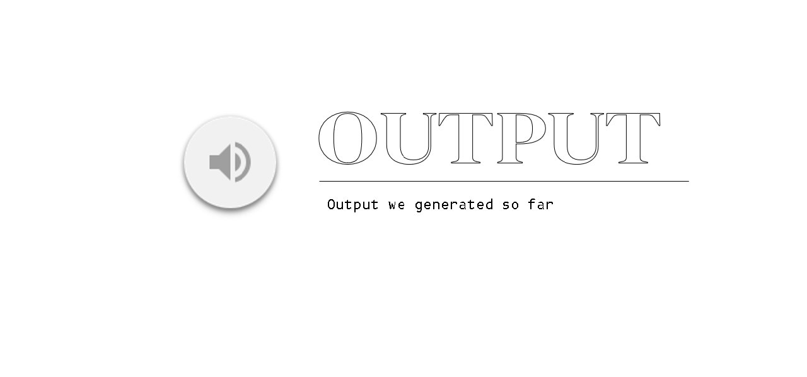

## 📄 DeepFake Voice Replication Project

The DeepFake project explores modern techniques in synthetic voice replication using deep learning. It focuses on how artificial intelligence can generate realistic voice clips mimicking human speech, raising important ethical and technical challenges. The aim is to understand how voice deepfakes are created, used, and potentially misused in real-world applications.

---

## ⚙️ Features

- Text-to-speech synthesis using AI
- Real-time voice cloning
- Basic GUI or CLI interface (if applicable)
- Analysis of deep learning models used in voice generation
- Overview of ethical implications

---

📁 Project Structure
-------------------
DeepFake/

- models/              # Pre-trained models and training scripts
- data/                # Sample voice datasets
- scripts/             # Training and synthesis scripts
- outputs/             # Generated voice samples
- docs/                # Report and references
- README.md            # Project documentation

  ---

## 🧠 Tech Stack

- Python 3.x

- TensorFlow / PyTorch

- NumPy, Librosa for audio processing

- WaveNet / Tacotron 2 (depending on model)

- Jupyter Notebooks for experimentation
  
---

## 🚀 How to Run the Project

---

Follow these steps to set up and run the project locally:

***Step 1: Clone the Repository***

# Clone the repo
git clone https://github.com/your-username/DeepFake-Voice.git

cd DeepFake-Voice

---

***Step 2: Install the Required Dependencies***

pip install -r requirements.txt

---

***Step 3: Run the Main Script***

Run voice synthesis

python scripts/generate_voice.py --text "Hello, world!"

---

## 📌 Results

## 📈 Output Image

🎧 [Click here to listen to the audio](jsir.wav)

---

## 🚀 Quick Tips
-------------
- Use high-quality training datasets for better voice realism

- Normalize audio before training

- Be mindful of ethical concerns when creating voice replicas

- Test with multiple voices and environments

---

## ✅ 📦 Prerequisites

- Python installed
  
- pip / conda environment
  
- Audio libraries: librosa, pyaudio, scipy
  
- GPU (optional but recommended)

---

## ✅ 📌 Conclusion

The DeepFake project demonstrates how advanced AI can replicate human speech convincingly. While this has applications in entertainment, accessibility, and communication, it also poses potential misuse risks. This project lays the foundation for developing detection and authentication systems to counter such risks.

---

## ✅ 📌 Key outcomes

- Understanding of how voice deepfakes are built
  
- Implementation of a basic deepfake audio generation system
  
- Awareness of ethical and security risks associated with voice synthesis

